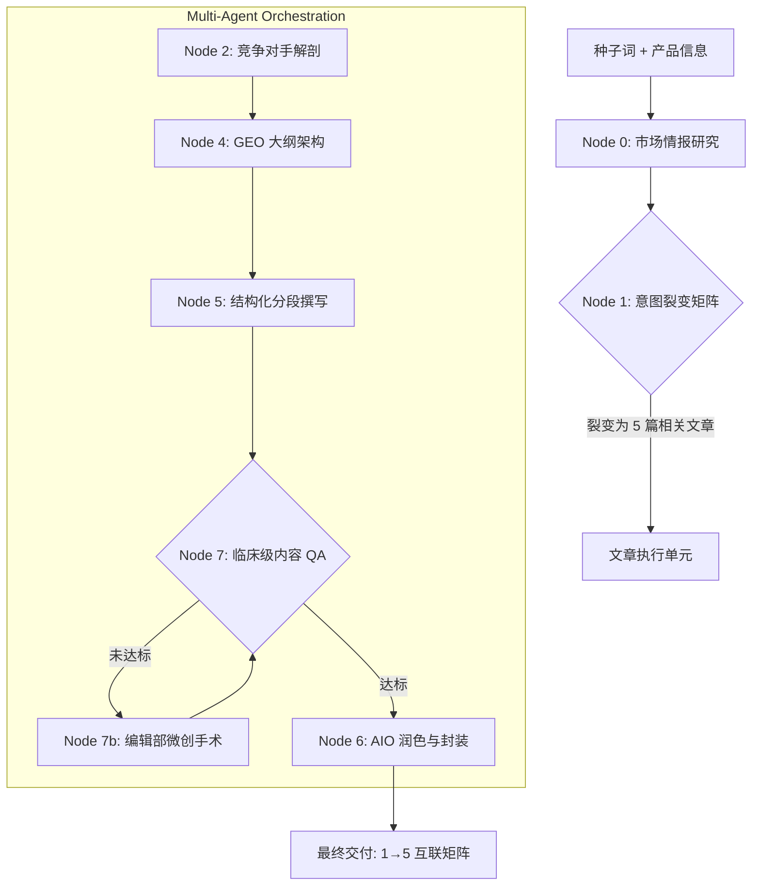

# SEO Content Architect | 矩阵式 SEO/GEO 内容工厂

这是一个专为现代搜索引擎（Google/Bing）及 AI 搜索（Perplexity/ChatGPT Use Search）设计的深度内容生产引擎。它超越了简单的文章生成，通过 **1→5 内容矩阵** 和 **多智能体协作流**，构建具备“信息增量”的话题权威。

---

## 核心设计理念

### 1. 从“单篇采集”到“矩阵霸屏” (Matrix Intelligence)
传统的 AI 写作是孤立的生成，而本项目采用 **中心放射状矩阵架构**。只需输入一个核心关键词，系统会自动裂变为 5 篇具有不同搜索意图（资讯型、对比型、操作型等）的深度长文。这些文章通过内置的“内链图谱”相互关联，形成话题权重，帮助产品在特定领域快速建立权威。

### 2. 信息增量：对抗“AI 垃圾内容” (Information Gain)
在 AI 内容泛滥的今天，搜索引擎更青睐具有**独到见解**和**未公开事实**的内容。
- **竞争对手解剖**：系统会模拟分析前 10 名的文章，寻找其信息漏洞和用户痛点。
- **隐藏事实挖掘**：专门提取专家级知识和行业内幕，确保每一篇文章都提供超出公开资料的“额外价值”。

### 3. GEO（生成式引擎优化）导向 (GEO-First)
针对 AI 搜索（如 Google SGE, Perplexity）的抓取特性，本项目集成了 **GEO 优化模块**：
- **前置总结 (GEO Summary)**：在文章开头提供高度概括、适合 AI 提取的结论。
- **数据注入 (Data Point Injection)**：强制在文章中嵌入真实数据和 Markdown 表格，提升结论的可信度。
- **AIO TL;DR**：专为 AI 总结器设计的超精简摘要。

### 4. 临床级内容审校 (Micro-Surgery Loop)
内置“内容审计”智能体，对生成的每一个片段进行实时质检。
- **QA 自动化**：检查是否有 AI 废话、是否包含足够的数据点。
- **显微手术 (Microsurgery)**：如果初稿未达标，编辑智能体会精准修改有问题的部分，而不是简单的重写。

---

## 业务逻辑架构图

---

## 业务逻辑节点细化

### 阶段一：情报与矩阵初始化 (Pre-Production)
*   **市场情报研究 (Node 0)**：不依赖预设，系统根据输入动态生成目标受众画像、专业写作人设及产品的 3-5 个差异化卖点。
*   **意图裂变 (Node 1)**：通过语义分析，将种子词拆解为相互独立又逻辑关联的 5 个意图维度（如：教程、对比、避坑、深研、趋势），从点到面覆盖关键词生态。

### 阶段二：深度拆解与规划 (Research & Architecting)
*   **竞争对手解剖 (Node 2)**：模拟全网搜索，识别现有内容的通病（如过时、片面、废话多），挖掘 3 条行业隐藏真相（专家级洞察），为“信息增量”奠定基础。
*   **GEO 大纲架构 (Node 4)**：打破传统目录，针对 AI 爬虫设计大纲，规划语义词（LSI）埋点，并预设 1:1 的锚文本映射图谱，实现矩阵内部自动互联。

### 阶段三：精密创作与质检 (Writing & QA)
*   **结构化分段撰写 (Node 5)**：人设驱动创作，强制执行“数据注入规则”。每段内容必须包含至少 2 个硬核事实，复杂对比处强制生成 Markdown 表格。
*   **微创手术 (Node 7/7b)**：这是系统的高级校准机制。QA 智能体会以审计员视角扫描冷场、AI 废话或逻辑断层。一旦发现风险，系统进入“微创”模式，仅对病灶部分进行针对性重塑，保持全文连贯性。

### 阶段四：AIO 交付 (Packaging)
*   **润色与 AIO (Node 6)**：执行“去 AI 化”清洗，剔除类似 'In conclusion' 等机器痕迹。最后封装为具备 AIO Summary（专为 AI 搜索生成的超精简块）的最终交付物。

---

## 核心驱动引擎 (AI Models & APIs)

系统通过 **Google AI SDK** 深度集成 **Google Gemini API**，并利用其原生内置工具实现数据闭环：

*   **实时搜索引擎 (Google Search Tool)**：在 Node 2 中直接调用 Google 实时搜索能力，确保竞争对手分析和事实核查的时效性。
*   **混合模型架构**：

| 任务节点 | 调用模型 | 核心能力 |
| :--- | :--- | :--- |
| **全网竞争研究** | `gemini-3.1-pro-preview` | **实时搜索 (Google Search Tool)**、深度推理 |
| **架构设计与创作** | `gemini-3.1-pro-preview` | 长上下文关联、深层事实分析 |
| **市场情报与意图** | `gemini-3-flash-preview` | 高速意图分类、受众特征提取 |
| **临床级 QA 与润色** | `gemini-3-flash-preview` | 快速语义审计、高吞吐量文本优化 |

---

## 工厂作业流程

| 阶段 | 任务描述 | 产出成果 |
| :--- | :--- | :--- |
| **情报检索** | 自动分析目标受众、用户画像及产品的核心卖点。 | **受众洞察报告** |
| **矩阵规划** | 基于搜索意图将种子词裂变为相互关联的 5 个话题簇。 | **内容矩阵蓝图** |
| **对手调研** | 扫描竞争对手弱点，锁定 3 个行业“隐藏真相”。 | **竞争性洞察** |
| **架构设计** | 生成包含 LSI 语义词和锚文本映射的深度大纲。 | **语义大纲 (Deep Outline)** |
| **分段撰写** | 严格执行 persona 设定，强行注入真实事实和对比表。 | **结构化正文** |
| **内容手术** | 循环审计内容质量，清除 AI 常用废话语式。 | **高纯度稿件** |
| **AIO 包装** | 生成针对 AI 搜索优化的 Meta 标签、内链及 TL;DR。 | **最终交付物** |

---

## 为什么选择此架构？

市面上 99% 的 AI 写作工具只是在“复读”现有的互联网信息。而 **SEO Content Architect** 的目标是成为一个**具备思考能力的编辑部**。它不仅在写作，更在进行**市场研究、策略规划和质量合规**，确保生产出的每一行代码（文字）都具备商业竞争力和搜索能见度。
